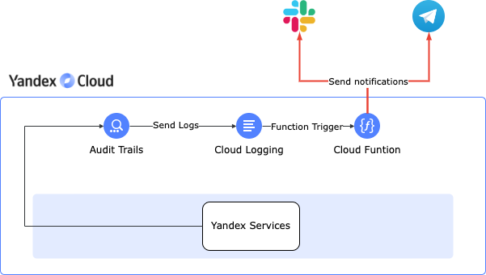

# Yandex Cloud ClickOps Notifier Terraform module

Terraform module which creates Yandex Cloud ClickOps Notifier resources.
ClickOps notifier is based on Yandex Cloud Function that monitors audit logs for manual actions (ClickOps) in your Yandex Cloud environment. 
When such actions are detected, the function sends notifications to Slack or Telegram to ensure compliance and visibility.

## Examples

Examples codified under
the [`examples`](https://github.com/terraform-yacloud-modules/terraform-yandex-module-template/tree/main/examples) are intended
to give users references for how to use the module(s) as well as testing/validating changes to the source code of the
module. If contributing to the project, please be sure to make any appropriate updates to the relevant examples to allow
maintainers to test your changes and to keep the examples up to date for users. Thank you!

<!-- BEGINNING OF PRE-COMMIT-TERRAFORM DOCS HOOK -->
## Requirements

| Name | Version |
|------|---------|
|  [terraform](#requirement\_terraform) | >= 1.3 |
|  [archive](#requirement\_archive) | >= 2.0 |
|  [yandex](#requirement\_yandex) | >= 0.72.0 |

## Providers

| Name | Version |
|------|---------|
|  [archive](#provider\_archive) | >= 2.0 |
|  [yandex](#provider\_yandex) | >= 0.72.0 |

## Modules

| Name | Source | Version |
|------|--------|---------|
|  [audit\_trails](#module\_audit\_trails) | git::https://github.com/terraform-yacloud-modules/terraform-yandex-audit-trails.git | v2.20.0 |
|  [audit\_trails\_logging\_group](#module\_audit\_trails\_logging\_group) | git::https://github.com/terraform-yacloud-modules/terraform-yandex-logging-group.git | v1.17.0 |
|  [function](#module\_function) | git::https://github.com/terraform-yacloud-modules/terraform-yandex-function.git | rc/1.16.0 |
|  [function\_logging\_group](#module\_function\_logging\_group) | git::https://github.com/terraform-yacloud-modules/terraform-yandex-logging-group.git | v1.17.0 |
|  [iam\_account](#module\_iam\_account) | git::https://github.com/terraform-yacloud-modules/terraform-yandex-iam.git//modules/iam-account | v1.28.0 |
|  [kms\_key](#module\_kms\_key) | git::https://github.com/terraform-yacloud-modules/terraform-yandex-kms.git | v1.27.0 |
|  [lockbox](#module\_lockbox) | git::https://github.com/terraform-yacloud-modules/terraform-yandex-lockbox.git | rc/1.20.0 |

## Resources

| Name | Type |
|------|------|
| [yandex_function_trigger.audit_trigger](https://registry.terraform.io/providers/yandex-cloud/yandex/latest/docs/resources/function_trigger) | resource |
| [archive_file.clickopsnotifier_zip](https://registry.terraform.io/providers/hashicorp/archive/latest/docs/data-sources/file) | data source |
| [yandex_client_config.client](https://registry.terraform.io/providers/yandex-cloud/yandex/latest/docs/data-sources/client_config) | data source |

## Inputs

| Name | Description | Type | Default | Required |
|------|-------------|------|---------|:--------:|
|  [audit\_trail\_data\_events\_filter](#input\_audit\_trail\_data\_events\_filter) | Structure describing filtering process for the service-specific data events | <pre>list(object({     service : string     resource_id : optional(string)     resource_type : string     included_events : optional(list(string))     excluded_events : optional(list(string))   }))</pre> | <pre>[   {     "resource_type": "resource-manager.folder",     "service": "apploadbalancer"   },   {     "resource_type": "resource-manager.folder",     "service": "mdb.mysql"   },   {     "resource_type": "resource-manager.folder",     "service": "compute"   },   {     "resource_type": "resource-manager.folder",     "service": "mdb.mongodb"   },   {     "resource_type": "resource-manager.folder",     "service": "lockbox"   },   {     "resource_type": "resource-manager.folder",     "service": "kms"   },   {     "resource_type": "resource-manager.folder",     "service": "iam"   },   {     "resource_type": "resource-manager.folder",     "service": "dns"   },   {     "resource_type": "resource-manager.folder",     "service": "smartwebsecurity"   },   {     "resource_type": "resource-manager.folder",     "service": "mdb.postgresql"   },   {     "resource_type": "resource-manager.folder",     "service": "websql"   },   {     "resource_type": "resource-manager.folder",     "service": "storage"   } ]</pre> | no |
|  [audit\_trail\_management\_events\_filters](#input\_audit\_trail\_management\_events\_filters) | Structure describing filtering process for management events | <pre>list(object({     resource_id : optional(string)     resource_type : string   }))</pre> | <pre>[   {     "resource_type": "resource-manager.folder"   } ]</pre> | no |
|  [blank\_name](#input\_blank\_name) | Blank name which will be used for all resources | `string` | `"clickops"` | no |
|  [excluded\_event\_sources](#input\_excluded\_event\_sources) | List of event sources that won't raise notifications. Format: a comma-separated string. | `string` | `null` | no |
|  [excluded\_event\_types](#input\_excluded\_event\_types) | List of event types that won't raise notifications. Format: a comma-separated string. | `string` | `null` | no |
|  [excluded\_subject\_names](#input\_excluded\_subject\_names) | List of subject names that won't raise notifications. Format: a comma-separated string. | `string` | `null` | no |
|  [excluded\_subject\_types](#input\_excluded\_subject\_types) | List of subject types that won't raise notifications. Format: a comma-separated string. | `string` | `null` | no |
|  [folder\_id](#input\_folder\_id) | Folder ID | `string` | `null` | no |
|  [function\_log\_level](#input\_function\_log\_level) | The default logging level for clickopsnotifier function | `string` | `"INFO"` | no |
|  [function\_trigger\_batch\_cutoff](#input\_function\_trigger\_batch\_cutoff) | Batch Duration in seconds for Yandex Cloud Functions Trigger | `number` | `10` | no |
|  [function\_trigger\_batch\_size](#input\_function\_trigger\_batch\_size) | Batch Size for Yandex Cloud Functions Trigger | `number` | `10` | no |
|  [labels](#input\_labels) | A set of labels | `map(string)` | `{}` | no |
|  [slack\_cc](#input\_slack\_cc) | List of Slack usernames to be added as CC to the notification message.   Provide this as a string separated by comma representing slack username ids (e.g., `<@U0422RZRC77>", <@U042211RC00>"`). | `string` | `"-"` | no |
|  [slack\_webhook\_url](#input\_slack\_webhook\_url) | List of subject names that won't raise notifications. Format: a comma-separated string. | `string` | `"-"` | no |
|  [telegram\_cc](#input\_telegram\_cc) | List of Telegram usernames to be added as CC to the notification message.   Provide this as a string separated by comma representing Telegram usernames (e.g., `user1, user2`). | `string` | `"-"` | no |
|  [telegram\_chat\_ids](#input\_telegram\_chat\_ids) | List of Telegram chat IDs that will be used for notifications. Ensure the provided `telegram_token` has access to the specified chat IDs. | `string` | `"-"` | no |
|  [telegram\_token](#input\_telegram\_token) | List of subject names that won't raise notifications. Format: a comma-separated string. | `string` | `"-"` | no |

## Outputs

No outputs.
<!-- END OF PRE-COMMIT-TERRAFORM DOCS HOOK -->

## License

Apache-2.0 Licensed.
See [LICENSE](https://github.com/terraform-yacloud-modules/terraform-yandex-module-template/blob/main/LICENSE).
